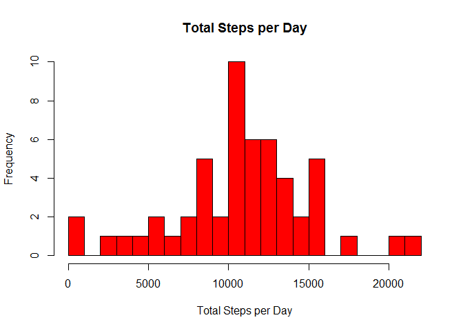
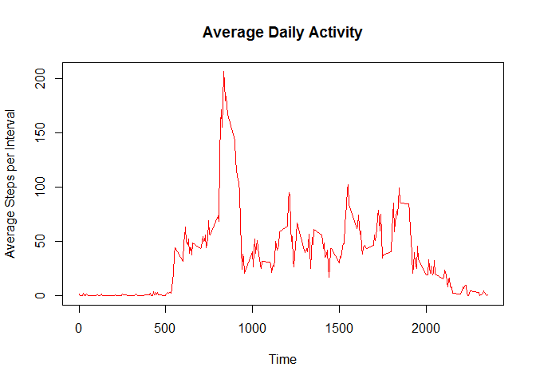
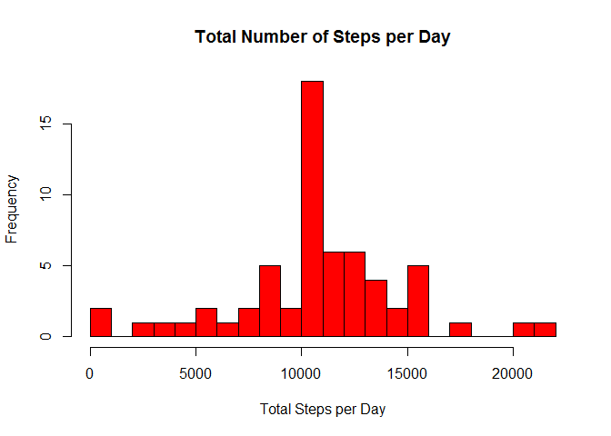

# Reproducible Research - Peer Assessment 1
Dexter Beza  
September 19, 2015  

## Loading and preprocessing the data


```r
  data <- read.csv("activity.csv", header=TRUE)
  data$date <- as.Date(data$date)
```

Load Packages

```r
  library(dplyr)
```

```
## 
## Attaching package: 'dplyr'
## 
## The following objects are masked from 'package:stats':
## 
##     filter, lag
## 
## The following objects are masked from 'package:base':
## 
##     intersect, setdiff, setequal, union
```

```r
  library(ggplot2)
```
## What is mean total number of steps taken per day?
1. Calculate the total number of steps taken per day.


```r
  totalStepsPerDay <- data %>%
    group_by(date) %>%
    summarize(totalSteps = sum(steps, na.rm=FALSE))
  head(totalStepsPerDay)
```

```
## Source: local data frame [6 x 2]
## 
##         date totalSteps
##       (date)      (int)
## 1 2012-10-01         NA
## 2 2012-10-02        126
## 3 2012-10-03      11352
## 4 2012-10-04      12116
## 5 2012-10-05      13294
## 6 2012-10-06      15420
```

2. Make a histogram of the total number of steps taken each day.


```r
hist(totalStepsPerDay$totalSteps, main="Total Steps per Day", xlab="Total Steps per Day",ylab="Frequency",breaks=20,col="red")
```

 

3. Calculate and report the mean and median of the total numberof steps taken per day.


```r
  mean(totalStepsPerDay$totalSteps, na.rm=TRUE)
```

```
## [1] 10766.19
```

```r
  median(totalStepsPerDay$totalSteps, na.rm=TRUE)
```

```
## [1] 10765
```

## What is the average daily activity pattern?

1. Make a time series plot of the 5-minute interval(x-axis) and the average number of steps taken, averaged across all days(y-axis).


```r
  avgStepsPerInterval <- data %>%
    group_by(interval) %>%
    summarize(avgSteps = mean(steps, na.rm=TRUE))
  
  plot(avgStepsPerInterval$interval, avgStepsPerInterval$avgSteps, type="l", main="Average Daily Activity", xlab="Time", ylab="Average Steps per Interval", col="red")
```

 

2. Which 5-minute interval, on average across all the days in the dataset, contains the maximum number of steps?


```r
  avgStepsPerInterval[which.max(avgStepsPerInterval$avgSteps),]
```

```
## Source: local data frame [1 x 2]
## 
##   interval avgSteps
##      (int)    (dbl)
## 1      835 206.1698
```

## Imputing missing values

1. Calculate and report the total number of missing values in the data set.


```r
  sum(is.na(data$steps))
```

```
## [1] 2304
```

2. Devise a strategy for filling in all of the missing values in the dataset. The strategy does not need to be sophisticated. For example, you could use the mean/median for that day, or the mean for that 5-minute interval, etc.

3. Create a new dataset that is equal to the original dataset but with the missing data filled in.


```r
  imputedData <- data
  indexNA <- is.na(imputedData$steps)
  
  avgInterval <- tapply(imputedData$steps,imputedData$interval, mean, na.rm=TRUE, simplify=TRUE)
  
  imputedData$steps[indexNA] <- avgInterval[as.character(imputedData$interval[indexNA])]
  
  head(imputedData)
```

```
##       steps       date interval
## 1 1.7169811 2012-10-01        0
## 2 0.3396226 2012-10-01        5
## 3 0.1320755 2012-10-01       10
## 4 0.1509434 2012-10-01       15
## 5 0.0754717 2012-10-01       20
## 6 2.0943396 2012-10-01       25
```

4. Make a histogram of the total number of steps taken each day.


```r
  imputedTotalStepsPerDay <- imputedData %>%
    group_by(date) %>%
    summarize(totalSteps = sum(steps, na.rm=FALSE))
  
  head(imputedTotalStepsPerDay)
```

```
## Source: local data frame [6 x 2]
## 
##         date totalSteps
##       (date)      (dbl)
## 1 2012-10-01   10766.19
## 2 2012-10-02     126.00
## 3 2012-10-03   11352.00
## 4 2012-10-04   12116.00
## 5 2012-10-05   13294.00
## 6 2012-10-06   15420.00
```

```r
  hist(imputedTotalStepsPerDay$totalSteps, main="Total Number of Steps per Day", xlab="Total Steps per Day", ylab="Frequency", breaks=20, col="red")
```

 

Calculate and report the mean and median of total number of steps taken per day.

Imputed Data:


```r
  mean(imputedTotalStepsPerDay$totalSteps)
```

```
## [1] 10766.19
```

```r
  median(imputedTotalStepsPerDay$totalSteps)
```

```
## [1] 10766.19
```

Original Data:


```r
  mean(totalStepsPerDay$totalSteps, na.rm=TRUE)
```

```
## [1] 10766.19
```

```r
  median(totalStepsPerDay$totalSteps, na.rm=TRUE)
```

```
## [1] 10765
```

Q: Do these values differ from the estimates from the first part of the assignment? What is the impact of imputing missing data on the estimates of the total daily number of steps?

A: The mean remained the same in both data sets; however, by imputing missing data in the new data set, the median moved closer to the mean in the new data set.

## Are there differences in activity patterns between weekdays and weekends?

1. Create a new factor variable in the dataset with two levels - "weekday" and "weekend" indicating whether a given date is a weekday or weekend day.


```r
  imputedData <- mutate(imputedData, weektype=ifelse(weekdays(imputedData$date) == "Saturday" | weekdays(imputedData$date) == "Sunday", "weekend", "weekday"))
  imputedData$weektype <- as.factor(imputedData$weektype)
  head(imputedData)
```

```
##       steps       date interval weektype
## 1 1.7169811 2012-10-01        0  weekday
## 2 0.3396226 2012-10-01        5  weekday
## 3 0.1320755 2012-10-01       10  weekday
## 4 0.1509434 2012-10-01       15  weekday
## 5 0.0754717 2012-10-01       20  weekday
## 6 2.0943396 2012-10-01       25  weekday
```

```r
  imputedData <- imputedData %>% group_by(interval, weektype) %>% summarise(steps = mean(steps))
```

2. Make a panel plot containing a time series plot of the 5-minute interval (x-axis) and the average number of steps taken, averaged across all wekkday days or weekend days (y-axis).


```r
  s <- ggplot(imputedData, aes(x=interval, y=steps, color=weektype)) +
    geom_line() +
    facet_wrap(~weektype, ncol=1, nrow=2)
  print(s)
```

 

Q: Are there differences in activity patterns between weekdays and weekends?

A: According to the data, the subject is more active in the mornings on weekdays. On the weekends, the subject is generally more active throughout the day.
